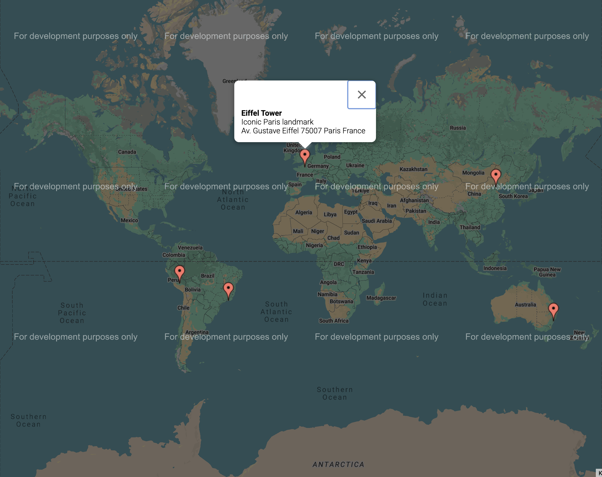

# Map CSV Project
This is a project that visualizes places from a CSV file on a Google Map and generates a text file categorizing these places.

⚠️ **Warning: API Key Security** ⚠️

🚨 **Do NOT deploy this project with your API keys as-is!** 🚨

Parcel builds the frontend in a way that **exposes your API keys** publicly. This project was created for learning purposes to demonstrate:

- 🏗️ **Polymorphism** in TypeScript  
- 🌐 **Frontend building** with Parcel  
- 📂 **CSV file processing**  
- 🗺️ **Google Maps integration**  
- 📍 **Geolocation APIs usage**  

🔒 **Recommendation:**  
- Use this project in **local development mode** only.  
- Explore secure methods to hide your API keys (e.g., using backend proxies, serverless functions, or environment variables with server-side handling).  

## Features

- Parses a CSV file of places (Name, Address, Description, Category).
- Geocodes addresses using the OpenCage API.
- Displays locations on Google Maps.
- Categorizes and writes place data to a `places.txt` file.

## Prerequisites

- [Node.js](https://nodejs.org/) installed.
- API Keys for:
  - **Google Maps JavaScript API** (for map display).
    ***You have to enable billing to use complete API features***
  - **OpenCage Geocoding API** (for address geocoding. Free tier available).

## Installation

1. **Clone the repository:**

   ```bash
   git clone git@github.com:yourusername/csv-to-map.git
   cd csv-to-map
   ```

2. **Install dependencies:**

   ```bash
   npm install
   ```

3. **Configure API Keys:**

   Create a `.env` file in the root directory:

   Add your API keys:

   ```env
   GOOGLE_MAPS_API_KEY=your_google_maps_api_key
   OPENCAGE_API_KEY=your_opencage_api_key
   ```

   - Get a Google Maps API key [here](https://developers.google.com/maps/documentation/javascript/get-api-key).
   - Get an OpenCage API key [here](https://opencagedata.com/).

## Usage

### Development Server

```bash
npm run start
```

This will:
- Parse the CSV (`places.csv`).
- Generate `places.txt` with categorized places.
- Launch a server displaying the map on `places.html`.

### Build for Production
⚠️ **Warning: API Keys Will Be Exposed!** ⚠️

🚨 Running `npm run build` will expose your API keys in the frontend.

🔒 **To stay safe:**  
- **Do not deploy** without securing your API keys.  
- Use this project for **local development only**.  
- Find safer ways to hide API keys if deploying.

🔧 **If you understand the risks and still want to build for production, use:** 

```bash
npm run build
```

### Development (CSV Parsing Only)

```bash
npm run dev
```

## Project Structure

```
map_csv/
├── image/
│   └── map_image.png
├── src/
│   ├── services/
│   │   ├── CsvPlaceParser.ts   # Parses the CSV file
│   │   ├── HtmlWriter.ts       # Handles HTML output
│   │   ├── TextWriter.ts       # Generates places.txt
│   │   └── Geocoder.ts         # Geocodes addresses using OpenCage API
│   ├── types/
│   │   ├── Place.ts            # Interface for place data
│   │   ├── global.d.ts 
│   │   └── IWritable.ts        # Interface for Writer classes
│   └── main.ts                 # Main program logic
├── places.csv                  # Input CSV with place data
├── places.html                 # Map visualization (to be generated)
├── places.txt                  # Categorized text output (to be generated)
├── .env                        # API keys
├── style.css
├── package.json
├── package-lock.json
├── tsconfig.json
├── .gitignore
└── README.md
```

## Example CSV (`places.csv`)

```csv
Name,Address,Description,Category
Eiffel Tower,Av. Gustave Eiffel 75007 Paris France,Iconic Paris landmark,Landmark
Sydney Opera House,Bennelong Point Sydney NSW 2000 Australia,World-renowned performing arts center,Theater
Great Wall of China,Huairou District Beijing China,Ancient wall stretching over 13000 miles,Historical Site
Machu Picchu,Inca Trail 08680 Peru,Ancient Inca city located in the Andes,Historical Site
Christ the Redeemer,Parque Nacional da Tijuca Rio de Janeiro Brazil,Iconic statue overlooking the city,Landmark
```

## Output (`places.txt`)

```
* Landmark *
- Eiffel Tower
  Address: Av. Gustave Eiffel 75007 Paris France
  Description: Iconic Paris landmark

- Christ the Redeemer
  Address: Parque Nacional da Tijuca Rio de Janeiro Brazil
  Description: Iconic statue overlooking the city

* Theater *
- Sydney Opera House
  Address: Bennelong Point Sydney NSW 2000 Australia
  Description: World-renowned performing arts center

* Historical Site *
- Great Wall of China
  Address: Huairou District Beijing China
  Description: Ancient wall stretching over 13000 miles

- Machu Picchu
  Address: Inca Trail 08680 Peru
  Description: Ancient Inca city located in the Andes
```

## Output (`google map`)



## Dependencies

- [TypeScript](https://www.typescriptlang.org/)
- [Parcel](https://parceljs.org/)
- [Axios](https://axios-http.com/)
- [Google Maps JavaScript API](https://developers.google.com/maps/documentation/javascript)
- [OpenCage Geocoding API](https://opencagedata.com/)
- [dotenv](https://www.npmjs.com/package/dotenv)
- [ts-node](https://www.npmjs.com/package/ts-node)